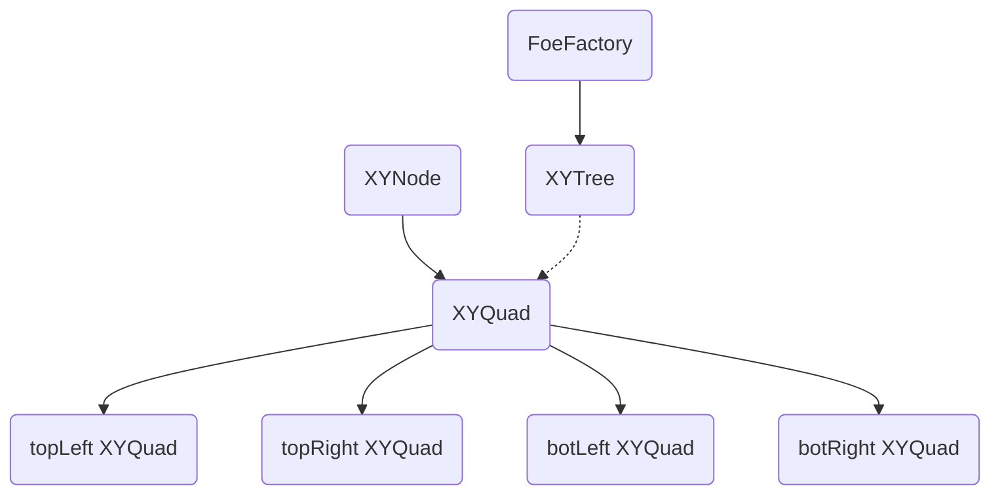

In progress... Beta ~ 31.10.2018
## Combat Halloween Solutions
### Foe System
Foe System based on special kind of tree with **4** children for every **quad**. Each quad is a template class based on XYNode template class that can be easily rearrange, also, quad consist of 4 child quads: topLeft, topRight, botLeft, botRight.  XYTree is just a wrapper that provides some basic methods like inserting.

